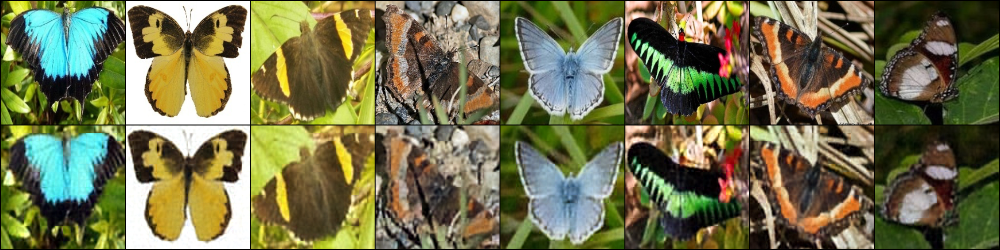
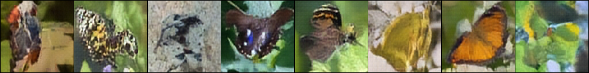

# baseline Latent Diffusion
(**including a theoretical summary in here very soon**)


VAE + DiT, both using 2D axial RoPE. VAE trained (for ~1.7k steps) to compress images into latents, then trains a diffusion transformer (for ~35k steps) on those latents

This is a bare minimum implementation, lots of room for improvement (optimization, modeling, data, ...).


## setup

```bash
uv sync
./download_kaggle_data.sh # if running on kaggle, directly point the config to the mount data root
```

## train

```bash
uv run python train_vae.py
uv run python train_dit.py
```

## sample

```bash
uv run python sample_vae.py
uv run python sample_dit.py
```

## samples

VAE reconstructions (top: input, bottom: recon):



DiT samples: 

